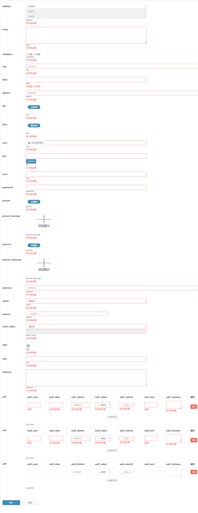

# Validator
表单前端验证功能


效果图

 


#### 用法
+ FormBuilder 表单项添加验证规则
  ```php
  $builder = new \Qscmf\Builder\FormBuilder();
  $builder
    ->addFormItem("school_name", "text", "school_name", "school_name")
    ->addRulesFromArray([
        'school_name' => ['required'],
    ]);
  ```
  
+ SubTableBuilder 子表格表单项添加验证规则
  ```php
  $sub1 = 'teacher_list';
  $sub2 = 'student_list';
  
  $builder = new \Qscmf\Builder\FormBuilder();
  $builder
    ->addFormItem("school_name", "text", "school_name", "school_name")
    ->addFormItem($sub1, "self", "self", "teacher_list", $this->buildSubFormBuilder(new SubTableBuilder(), 'teacher')->makeHtml())
    ->addFormItem($sub2, "self", "self", "student_list", $this->buildSubFormBuilder(new SubTableBuilder(), 'student')->makeHtml())
      ->addFormItem("sub3", "self", "self", "sub_form", $this->buildSubFormBuilder(new SubTableBuilder(), 'sub3')->makeHtml())
    ->addRulesFromArray([
        'school_name' => ['required'],
        $sub1 => [
            'type' => 'sub_table', // 添加子表格标识
            'rules' => [
                $sub1."_num" => [['required', true,'必填'],'number',['minlength', 2], ['maxlength', 5]],
                $sub1."_date" => [['required'], 'date'],
                $sub1."_district" => [['required']],
                $sub1."_select" => [['required']],
                $sub1."_select2" => [['required']],
                $sub1."_text" => [['required', true,'必填']],
                $sub1."_textarea" => [['required']],
            ]
        ],
        $sub2 => [
            'type' => 'sub_table', // 添加子表格标识
            'rules' => [
                $sub2."_num" => [['required', true,'必填'],'number'],
                $sub2."_date" => [['required'], 'date'],
                $sub2."_district" => [['required']],
                $sub2."_select" => [['required']],
                $sub2."_select2" => [['required']],
                $sub2."_text" => [['required', true,'必填']],
                $sub2."_textarea" => [['required']],
            ]
        ],
    ]);
  
  
  protected function buildSubFormBuilder(SubTableBuilder $builder, string $sign, bool $need_validate = false):SubTableBuilder{
      $mock_list = DBCont::getStatusList();
  
      $builder
          ->setNeedValidate($need_validate)
          ->addTableHeader($sign."_num", "250")
          ->addTableHeader($sign."_date", "250")
          ->addTableHeader($sign."_district", "250")
          ->addTableHeader($sign."_select", "250")
          ->addTableHeader($sign."_select2", "250")
          ->addTableHeader($sign."_text", "250")
          ->addTableHeader($sign."_textarea", "250")
          ->addFormItem($sign."_num", "num", "", "", "", "")
          ->addFormItem($sign."_date", "date", "", "", "", "")
          ->addFormItem($sign."_district", "district", ['level' => 3], "", "", "")
          ->addFormItem($sign."_select", "select", $mock_list, "", "", "")
          ->addFormItem($sign."_select2", "select2", $mock_list, "", "", "")
          ->addFormItem($sign."_text", "text", "", "", "", "")
          ->addFormItem($sign."_textarea", "textarea", "", "", "", "")
          ;
  
      return $builder;
  }
  ```
  + 获取表单提交数据
  
    子表格开启验证功能后，字段索引值有可能不连续，可以使用便捷函数处理，将字段改成连续索引的数组
    
    ```php
    // 修改前：teacher_list_num => [1=>1,2=>3]
    // 修改后：teacher_list_num => [1,3]
    
    $data = ValidatorManager::reIndexSubTableData(I('post.'));
    ```
  
+ **addRulesFromArray** 用法

  格式为 **['字段名' => 字段规则数组]**

  [字段规则数组的元素用法参考](FieldValidator.md#addRule)


#### 验证规则说明

| 名称         | 参数类型            | 错误提示                             |
| ------------ | ------------------- | ------------------------------------ |
| required     | boolean，默认为true | 请输入                               |
| email        | boolean，默认为true | 请输入有效的电子邮件地址             |
| url          | boolean，默认为true | 请输入有效的网址                     |
| date         | boolean，默认为true | 请输入有效的日期 (YYYY-MM-DD)        |
| number       | boolean，默认为true | 请输入有效的数字                     |
| digits       | boolean，默认为true | 只能输入数字                         |
| equalTo      | mixed               | 你的输入不相同                       |
| max_length   | number              | 最多可以输入 {0} 个字符              |
| min_length   | number              | 最少要输入 {0} 个字符                |
| range_length | number,number       | 请输入长度在 {0} 到 {1} 之间的字符串 |
| range        | number,number       | 请输入范围在 {0} 到 {1} 之间的数值   |
| max          | number              | 请输入不大于 {0} 的数值              |
| min          | number              | 请输入不小于 {0} 的数值              |


#### 前端自定义表单项验证

##### 注册事件  customValidatorItem

###### 参数说明

| 名称              | 参数类型                        | 说明                                                         |
| ----------------- | ------------------------------- | ------------------------------------------------------------ |
| form              | object，builder form 的node节点 | 可以通过 form.validate() 获取验证插件对象                    |
| customValidateErrorMap | object，{field:false}           | 存在值则阻塞form提交 |

###### 使用场景

+ 根据 validator 插件验证结果，动态修改输入框的颜色

  使用隐藏dom元素收集最终值，需要将错误提示定位到输入的dom元素，例如复杂组件 select2，district

  + select2

    + 检查默认的 select 是否有 id 属性，没有则添加

    + 注册事件

      ```javascript
      $('body').on('customValidatorItem', '.builder-form', function(event, form, customValidateErrorMap) {
          const name = "{$form.name}";
          const selectId = "select2-{$gid}-container";
          const selectSpan = $(`#${selectId}`).parents('.select2-selection--single');
      
          updateDomErrorClass(form, name, selectSpan) // 动态修改选择框的颜色
      });
      ```

  + district

    + 给输入框添加 data-qs-validator-name 属性

    + 注册事件

      ```javascript
      $('body').on('customValidatorItem', '.builder-form', function(event, form, customValidateErrorMap) {
          const name = "{$form.name}";
          const thatDom = $("input[data-qs-validator-name='"+name+"']");
      
          updateDomErrorClass(form, name, thatDom)
      });
      ```

​       

+ 自定义表单项验证结果

  ```javascript
    $('body').on('customValidatorItem', '.builder-form', function(event, form, customValidateErrorMap) {
      const name = "{$name}";
      const selectId = "select2-{$gid}-container";
  
      if(hasSetValidate(form, name) && !hasError(form, name)){
        const errorClass = form.validate().settings.errorClass
        const res = $('#{$gid}').select2().val() === '1' // 自定义验证规则
        const message = '错误信息' // 自定义错误信息
        
  
        if(res === false){
          customValidateErrorMap[name] = false;
          $(`#${selectId}`).closest('.select2-selection--single').addClass(errorClass)
          form.validate().showLabel($(`#${selectId}`).closest('.select2-selection--single'), message)
        }else if(customValidateErrorMap.hasOwnProperty(name)){
          delete customValidateErrorMap[name];
          $(`#${selectId}`).closest('.select2-selection--single').removeClass(errorClass)
        }
      }
  
    });
  ```

  

  + 验证组件值，将结果更新到 customValidateErrorMap
    + 通过则移除添加属性
    + 不通过则添加属性
  + 显示输入框的错误提示
    + 获取错误样式：form.validate().settings.errorClass
    + 设置错误提示dom：form.validate().showLabel.(element, message )

  

   

 

